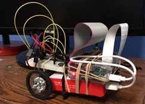

#  fetchbot

Fetchbot is a robotics project with the end goal of creating a roving bot that can chase, pick up, and return a ball.

## Fetchbot Alpha

The first version only has the intermediate goal of chasing a ball, so no grabbing mechanism is needed.

### Hardware

* [Actobotics ActoBitty 2](https://www.sparkfun.com/products/13047) chassis, wheels, 2 DC motors, and 4 AA battery pack.
* [Raspberry Pi 2](https://www.raspberrypi.org/products/raspberry-pi-2-model-b/)
* [Raspberry Pi Camera](https://www.raspberrypi.org/products/camera-module/)
* [Inland 2,600mAh Power Bank Battery Charger for Mobile Devices](http://www.microcenter.com/product/447265/2,600mAh_Power_Bank_Battery_Charger_for_Mobile_Devices) for remote power to the Raspberry Pi.
* [L293D motor control chip](https://www.adafruit.com/product/807)
* [Canakit Raspberry Pi GPIO Breakout Board](https://www.canakit.com/raspberry-pi-cobbler-gpio-breakout.html) and wires
* A bunch of rubber bands to try and hold everything together.

### Software

* OS - Raspbian Jessie
* Development Language - Node.js 6.0
* GPIO library - [pigpio](https://www.npmjs.com/package/pigpio)

The AI architecture is based on [Behavioral Logic](http://behaviorallogic.com/api/spec). The visual processing is from [Frogeye](https://github.com/chrisbroski/frogeye).

### Notes

Though inelegant and graceless, this mess actually works. Here are the major unsolved challenges with proposed solutions, if any.

#### It's a Complete Mess

I purchased an [Adafruit Perma-Proto Hat](https://www.adafruit.com/products/2310) that should, with some soldering, clean up the mess that is the breadboard. I'll need to get an [Actobotics Pi channel mount](https://www.sparkfun.com/products/13050) too as the one that came with the kit only fits Arduino. The front "caster" on the Actobitty is just a plastic skid. I'd like to find a better wheel, or maybe just upgrade to a more advanced rover kit.

#### Vision Is Probably Not Enough Senses

I believe that I will require a way to tell if the rover gets stuck or collides with something. I have a [Sense Hat](https://www.raspberrypi.org/products/sense-hat/) that includes accelerometer/gyroscope/magnetometer sensors so I may try to use that or look for a simpler solution.

#### Raspberry Pi Camera Module

The Pi camera comes with everything needed for this project (I use `child_process.spawn` to execute `raspiyuv` bash commands from Node.js.) It just doesn't work very well. Its main shortcomings are:

##### Low FPS

The fastest I have been able to get image data is about 4Hz (one picture every 250ms.) I worry that this is too slow.

##### Fragmented Image Data

Executing `raspiyuv` in timelapse mode frequently returns partial images. I wrote some code to reassemble these so I think the problem is mostly handled.

##### Weird Errors

I see this way too much:

    stderr: mmal: mmal_vc_component_enable: failed to enable component: ENOSPC
    mmal: camera component couldn't be enabled
    stderr: mmal: main: Failed to create camera component
    stderr: mmal: Failed to run camera app. Please check for firmware updates

I have been spending too much time trying to fix this. For a prototype I am not going to worry too much, but I'll need more stable hardware eventually. It seems that the Raspberry Pi Camera is not designed for production applications of this nature (visual AI processing.)

### Why Node.js?

Node.js is working great for AI programming. A low-level language like C doesn't have the advanced abstractions needed and a Duplo language like Arduino is appropriate only for animatronics. Lisp or Erlang are better than the JavaScript in this respect but I don't know those languages. Why didn't I use Python? Um, hey, look over there! A robot!

Use [n](https://github.com/tj/n) to install and upgrade Node.js on your Raspberry Pi. Everything else sucks.
